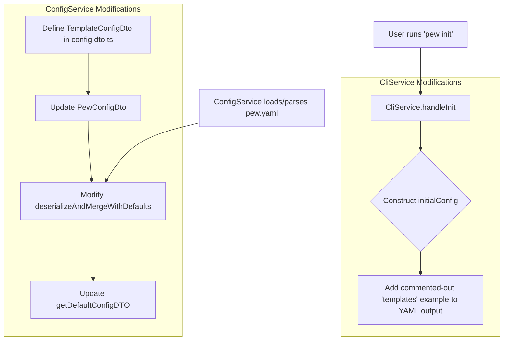

# 🔖 Description
> 💡 *This story focuses on establishing the foundational configuration structure within `pew.yaml` for defining code generation templates. It also ensures that users are introduced to this new feature via an example in the default `pew.yaml` created by `pew init`.*
---

# 🗣 User Story
> 💡 ***As a*** *CLI User* ***I want*** *to define code generation templates (including their variables, replacements, root directory, and source files) within my `pew.yaml` file* ***so that*** *I can easily manage, version, and share my project scaffolding configurations alongside my project.*
---

# ⚙️ Requirements
> 💡 *What are the requirements for this story? What should be in scope and what should be out of scope?*
---
*   **In Scope:**
    *   Modifying `ConfigService` to parse and validate a new `templates` map in `pew.yaml`.
    *   Defining the structure of a template object: `variables` (map), `replacements` (map), `root` (string), `files` (list of strings).
    *   Updating the `pew init` command to include a commented-out, descriptive example of the `templates` configuration in the `pew.yaml` it generates.
    *   Updating project documentation (e.g., README) to describe the new `templates` configuration.
*   **Out of Scope:**
    *   Implementation of the `pew create` command logic (covered in subsequent stories).
    *   Advanced validation of template file paths or content.

# ✅ Acceptance Criteria
> 💡 *Specific conditions that must be met for the story to be considered complete. Each criterion should be testable and unambiguous.*
---

* [x] Criterion 1: `ConfigService` can correctly parse and validate the new `templates` map from `pew.yaml`.
* [x] Criterion 2: The `templates` key in `pew.yaml` is a map where each key is a template name (string).
* [x] Criterion 3: Each template object within the `templates` map must support:
    *   `variables`: An optional map (string keys, string values).
    *   `replacements`: An optional map (string keys, string values).
    *   `root`: An optional string representing a single path.
    *   `files`: A required list of strings (file paths).
* [x] Criterion 4: When `pew init` is run, the generated `pew.yaml` (or the default global config if no local one is created) includes a commented-out section demonstrating the `templates` structure with clear descriptions for each field and sub-field. The example must be valid YAML if uncommented.
* [x] Criterion 5: Project documentation (e.g., README.md or a dedicated config doc) is updated to reflect the new `templates` structure in `pew.yaml`.

# 💾 Data Model
> 💡 *Old and new data models that will be created and/or altered when this feature is added.*
---
*   **New/Altered:**
    *   `PewConfigDto` (in `src/io/config.dto.ts`) will be extended to include an optional `templates` field.
    *   The `templates` field will be a map: `[templateName: string]: TemplateConfigDto`.
    *   A new `TemplateConfigDto` will define the structure:
        ```typescript
        interface TemplateConfigDto {
          variables?: Record<string, string>;
          replacements?: Record<string, string>;
          root?: string;
          files: string[];
        }
        ```
    *   `pew.yaml` file format will be updated to include the `templates:` section.

# 🔒 Security Rules / Row Level Security
> 💡 *Old and new security rules with roles and access that should be created and/or altered. Include create, read, update and delete.*
---
Not Applicable. This feature primarily deals with local file configuration and generation. Standard file system permissions apply.

# 🐒 API
> 💡 *Old and new API calls that should be created and/or altered.*
---
Not Applicable (CLI tool, no external API calls are being added or altered for this story). Internal service APIs within `ConfigService` will change.

# 📊 Analytics
> 💡 *Old and new analytics that should be created and/or altered when this feature is added. Include a name, when it's fired and optional properties.*
---
Not Applicable for this story.

# ☎️ Impact Communication
> 💡 *Who / which teams should we inform about the impact of releasing this ticket? Sales, marketing, data, CS, other?*
---
*   Users of `pew-pew-cli` (via release notes and documentation).
*   Internal documentation maintainers (if any).

# 🧪 Tests
> 💡 *Components/flows/code that would benefit from tests and which scenario's should be tested.*
---
*   `ConfigService`:
    *   Test parsing of `pew.yaml` with valid `templates` sections (empty, with one template, with multiple templates).
    *   Test parsing with various valid combinations of optional fields (`variables`, `replacements`, `root`).
    *   Test parsing with missing required `files` field (should ideally use defaults or handle gracefully, though full error handling is in a later story).
    *   Test that `ConfigService` provides default empty `templates` map if the section is missing.
*   `CliService` (`handleInit`):
    *   Test that `pew init` generates a `pew.yaml` containing the correct commented-out example for `templates`.
    *   Test `pew init --force` also includes the example.

# 🤝 Acceptance Test
> 💡 *Which scenario's should we test in the acceptance test? So that we can make sure that this ticket does what it is supposed to do without any unexpected errors.*
---
1.  Run `pew init` in a new directory. Verify `pew.yaml` is created and contains the commented-out `templates` example with descriptions.
2.  Manually create a `pew.yaml` with a valid `templates` section. Ensure the CLI can start and internal services can access this configuration without error (e.g., by running a simple command like `pew next task` which loads config).
3.  Uncomment the example in the `pew.yaml` generated by `pew init`, ensure it's valid YAML, and that the CLI can parse it.
4.  Check updated documentation for correctness regarding the `templates` section.

# 🎨 UI/UX Behaviour
> 💡 *Anything to take note of regarding the behaviour of UI/UX elements (if applicable). Think of position, behaviour when elements do not fit the screen, feedback on elements and properties of animations.*
---
*   The commented-out example in `pew.yaml` should be clearly formatted and easy to understand.
*   Descriptions within the example should accurately explain each field.

# ⏱️ Effort Breakdown & Estimates
> 💡 *Detailed breakdown of estimated effort required for each aspect of the user story implementation.*
---

*   **Design:** [0.5] hours
    *   _Reasoning: Finalizing the DTO structure for `TemplateConfigDto` and the exact YAML example format._
*   **Refinement:** [0.5] hours
    *   _Reasoning: Reviewing ACs and ensuring alignment with overall epic goals._
*   **Front-end:** [0] hours
    *   _Reasoning: Not applicable (CLI tool)._
*   **Backend:** [2] hours
    *   _Reasoning: Modifying `ConfigService` for new DTOs, parsing logic, and updating `CliService.handleInit`._
*   **General Work:** [1] hours
    *   _Reasoning: Updating documentation (README.md or other relevant docs)._

# 🧪 QA, Testing & Delay Margin
> 💡 *Estimates for quality assurance, testing efforts, and buffer time for potential delays.*
---

*   **QA:** [0.5] hours ([~14]%)
    *   _Reasoning: Manual verification of `pew init` output and `pew.yaml` structure._
*   **Testing:** [1] hours ([~28]%)
    *   _Reasoning: Writing unit tests for `ConfigService` parsing and `handleInit` behavior._
*   **Delay Margin:** [0.5] hours ([~14]%)
    *   _Reasoning: Buffer for potential complexities in `ConfigService` modifications or YAML example formatting._

# 📝 Suggested High Level Approach
> 💡 *With knowledge of the current codebase, try to define a best suggested approach. Think of current components used, flow of data and UI elements. Include mermaid diagrams to illustrate flows and connections.*
---
1.  Define `TemplateConfigDto` and update `PewConfigDto` in `src/io/config.dto.ts`.
2.  Modify `ConfigService.deserializeAndMergeWithDefaults` to handle the new `templates` field, ensuring it correctly parses the map structure and applies defaults if parts are missing.
3.  Update `ConfigService.getDefaultConfigDTO` to include a default (likely empty) `templates` map.
4.  In `CliService.handleInit`, when constructing `initialConfig` or writing the YAML, add the standard commented-out example for the `templates` section. This example should be stored as a multi-line string constant.
5.  Write unit tests for `ConfigService` to verify parsing of various `templates` configurations.
6.  Update documentation.



# 🎯 Roles & Todo's
> *Backend Dev · Front-end Dev · Ui/Ux Designer · DevOps Engineer*
---

* 📌 **Project Manager**:
    - [ ] Review and approve the story.
    - [ ] Track progress.
* 🔧 **Backend Developer**:
    - [ ] Define/Update `PewConfigDto` and related DTOs for templates.
    - [ ] Implement parsing logic for the `templates` section in `ConfigService`.
    - [ ] Update `CliService.handleInit` to include the commented-out `templates` example in `pew.yaml`.
    - [ ] Write unit tests for `ConfigService` changes.
    - [ ] Update relevant documentation (e.g., README.md) regarding `pew.yaml` structure.
* 🖥️ **Front-end Developer**:
    - [ ] Not Applicable
* 🎨 **UI/UX Designer**:
    - [ ] Not Applicable
* 🚀 **DevOps Engineer**:
    - [ ] Not Applicable
* 📊 **Data Engineer**:
    - [ ] Not Applicable
* 📣 **Marketeer**:
    - [ ] Not Applicable

# 👉️ Final Remarks
> 💡 *Anything to take note off that is not properly defined yet. Think of out of scope notes, dependencies, anything to be extra cautious about and/or information about related issues.*
---
*   The exact content and wording of the commented-out example in `pew.yaml` should be carefully crafted for clarity and correctness.
*   This story lays the groundwork for all subsequent template-related stories.
*   Error handling for malformed `templates` section is covered in a separate story (Story 8), but basic parsing should be robust.